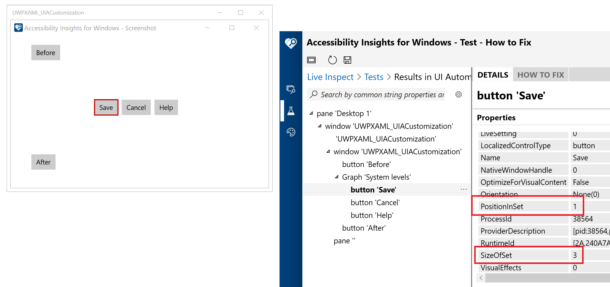

# UWPXAML_UIACustomization
This tiny UWP XAML demo app shows  how to customize the UIA representation of UI elements through use of the AutomationProperties class in markup.

The UIA Name and LocalizedControlType properties are set by adding related localized strings, and having those strings referenced via the x:Uid of the custom control.

The UIA SizeOfSet and PositionInSet properties for some elements are set explicitly through the AutomationProperties class in markup.

An image and text element are added only to show how they can be marked as not being of interest to customers using screen readers, through use of AutomationProperties.AccessibilityView in markup.

The screenshot below shows the Accessibility Insights for Windows tool reporting the UIA hiearchy of the app. The custom control has the expected Name and LocalizedControlType of "System levels" and "Graph" respectively. The contentless image and text string are appropriately not shown in the UIA heirarchy. The highlighted button inside the custom control has PositionInSet and SizeOfSet properties of 1 and 3 respectively.

